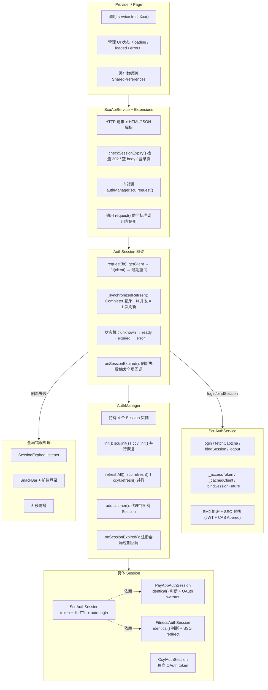
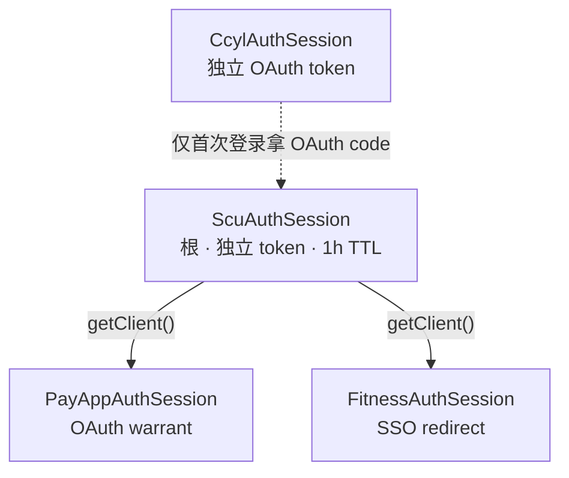
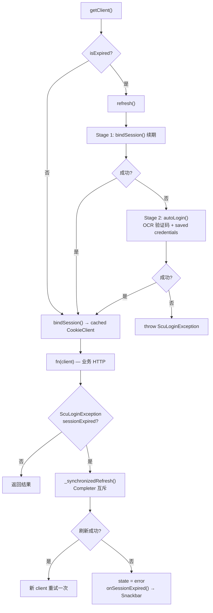
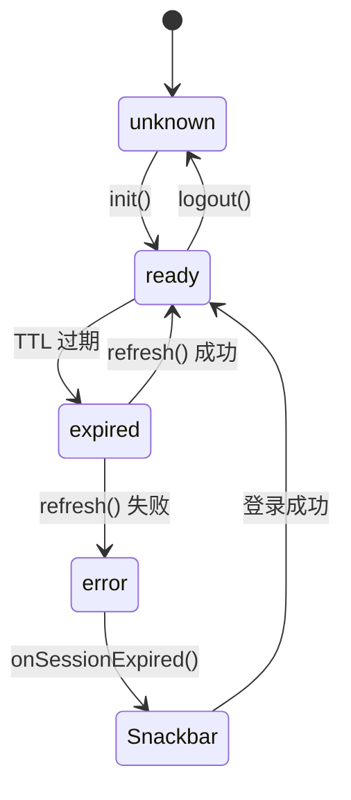
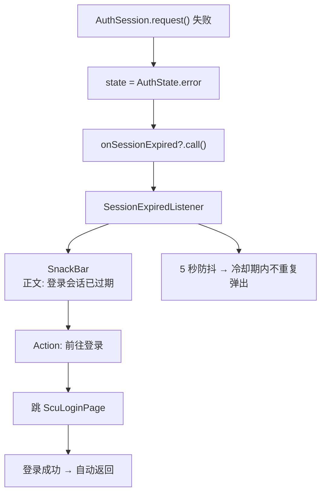
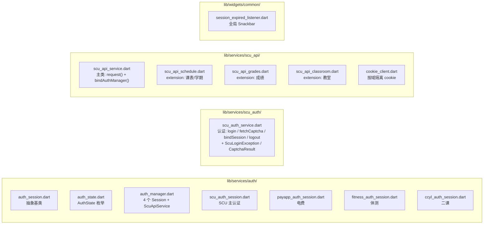
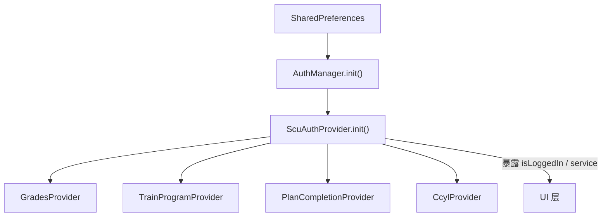

# 认证架构设计决策

## 概述

统一管理 SCU 统一认证、电费查询、体测查询、第二课堂四个后端服务的认证生命周期。核心目标：

1. 业务方一行调用，不碰认证细节
2. Session 过期自动重试（静默续期 / OCR 自动登录）
3. 刷新失败时全局提示（Snackbar + 前往登录）
4. 并发请求不会触发多次刷新

## 架构分层



### 各层详细职责

| 层 | 关心什么 | 不关心什么 |
|---|---|---|
| **Provider / Page** | UI 状态流转（loading → loaded → error）、数据缓存、用户交互 | HTTP 细节、cookie 管理、token 过期、重试逻辑 |
| **ScuApiService** | HTTP 数据请求 + HTML/JSON 解析、过期信号检测（302/空body/登录页） | 登录态管理、UI 状态、缓存策略 |
| **ScuAuthService** | 认证：login / fetchCaptcha / bindSession / logout，SM2 加密、SSO 预热 | HTTP 业务请求、UI 状态、数据解析 |
| **AuthSession 框架** | token 过期判断、自动刷新、并发互斥、重试一次、触发过期回调 | 具体 HTTP 怎么发、数据怎么解析、UI 怎么显示 |
| **AuthManager** | 4 个 Session 的生命周期 + ScuApiService、并行初始化/刷新、全局回调注册 | 具体 token 格式、HTTP 细节、UI 状态 |
| **具体 Session** | 自己的认证方式（token/OAuth/SSO）、过期判断、refresh 策略 | 其他 Session 的存在、UI 状态、业务数据格式 |
| **SessionExpiredListener** | 全局 Snackbar 展示、防抖、导航到登录页 | 具体哪个 Session 过期、数据怎么恢复 |

## 4 个 Session 的依赖关系



## 关键调用链

**业务调用**（Provider）：
```dart
final data = await _authProvider.service.fetchSchemeScores();
```

**展开**：
1. `_authProvider.service` → `ScuApiService`
2. `fetchSchemeScores()` 是 `extension ScuApiGrades` 的方法
3. 内部调 `_authManager.scu.request((client) => ...)`
4. `request()` 是 `AuthSession` 模板方法

**`request()` 内部**：



## 状态机



## 全局错误处理



## 关键设计决策

### 1. 为什么用 `request()` 而非手动 try/catch

**问题**：原来每个 provider 都要写：
```dart
try {
  final client = await authProvider.service.bindSession();
  final resp = await client.get(...);
  if (resp.statusCode == 302) throw ScuLoginException(sessionExpired: true);
} on ScuLoginException catch (e) {
  if (e.sessionExpired) await SessionExpiryHandler.handle(authProvider);
  // setState error...
}
```

**方案**：`request(fn)` 封装了 getClient → 执行 → 过期检测 → 互斥刷新 → 重试的完整流程。Provider 只需：
```dart
final data = await _authProvider.service.fetchSchemeScores();
```

`_checkSessionExpiry()` 抛的 `ScuLoginException(sessionExpired: true)` 会被 `request()` 自动捕获并走刷新路径。

### 2. 为什么 `request()` 在 Service 层而非 Provider 层

**方案 A（旧）**：Provider 包 `request()`，传 client 给 service
```dart
final data = await authManager.scu.request(
  (client) => service.fetchSchemeScores(client: client),
);
```

**方案 B（当前）**：Service 内部包 `request()`，Provider 直接调用
```dart
final data = await service.fetchSchemeScores();
```

选择方案 B 的原因：
- Provider 层完全不碰认证细节，职责更清晰
- `fetchXxx` 方法签名更干净，不需要 `{CookieClient? client}` 参数
- `request()` 的位置集中在 service 层，改起来只动一处
- Provider 只依赖 `ScuAuthProvider`，不需要直接依赖 `AuthManager`

### 3. 为什么用 `extension` + `part` 拆分 Service

`ScuApiService`（数据层）只有 `bindAuthManager` + `request` + `_checkSessionExpiry` + 三个业务域的 fetch 方法。

用 `extension on ScuApiService` + `part of` 拆分：
- `part` 文件共享库作用域，可以访问 `_authManager`、`_checkSessionExpiry()` 等私有成员
- 每个业务域独立一个文件，便于定位和维护
- 静态配置（`requestHeaders`）放在 `ScuAuthService` 中，通过公开 getter 暴露给 extension

### 4. 为什么 Auth 和 API 拆成两个 Service

`ScuApiService` 原本同时承担认证（login/bindSession）和数据请求（fetchXxx）两种完全不同的职责——认证是"一次性的开关"，数据请求是"每次业务都要用"。混在一起导致：
- 类名误导（先后叫 `ScuAuthService` 和 `ScuApiService` 都不准确）
- 出现循环依赖的 `bindAuthManager(this)` 延迟绑定 hack
- `ScuApiService` 无法独立单测（必须 mock AuthManager）

拆分后：
- `ScuAuthService` —— 仅认证，无任何依赖，可独立单测
- `ScuApiService` —— 仅数据，依赖 AuthManager 用于 `request()` 转发
- 单向依赖链：`ScuApiService → AuthManager → ScuAuthSession → ScuAuthService`

`ScuApiService` 仍保留 `bindAuthManager(this)` 是因为它需要转发到 `_authManager.scu.request()`。这是 `request()` 模式的固有限制（数据层不知道如何拿已认证 client，必须由框架注入）。`ScuAuthService` 彻底摆脱了这个 hack。

```dart
// ScuApiService
late AuthManager _authManager;
void bindAuthManager(AuthManager mgr) => _authManager = mgr;

// AuthManager 构造函数
AuthManager(SharedPreferences prefs) {
  scu = ScuAuthSession(prefs);
  scu.service.bindAuthManager(this);  // 构造完成后绑定
  ...
}
```

### 5. 为什么用 `identical()` 判断 client 是否更换

SCU refresh 后 `bindSession()` 返回新的 `CookieClient` 实例（cookie 已重置）。PayApp/Fitness 需要知道是否要重新走 OAuth/SSO。

用 `identical(client, _cachedClient)`（引用相等）而非值比较：
- `CookieClient` 没有实现 `==`，引用相等是唯一可靠的判断方式
- 比 cookie 内容比较更高效
- 语义明确："是不是同一个 client 实例"

### 6. 为什么用 `Completer` 做并发互斥

100 个并发请求同时触发过期，不应该执行 100 次 `refresh()`。

```dart
Completer<bool>? _refreshCompleter;

Future<bool> _synchronizedRefresh() async {
  if (_refreshCompleter != null) return _refreshCompleter!.future;  // 排队等结果
  _refreshCompleter = Completer<bool>();
  try {
    final result = await refresh();
    _refreshCompleter!.complete(result);
    return result;
  } finally {
    _refreshCompleter = null;
  }
}
```

第 1 个请求创建 `Completer` 并执行 `refresh()`。其余 99 个 `await` 同一个 `Completer.future`，共享结果。`finally` 清空 `Completer`，下一个过期周期可以重新开始。

### 7. 为什么用 Snackbar 而非 Dialog

旧方案用 `SessionExpiryHandler` 弹 `AlertDialog`（阻塞式，用户必须点击才能继续）。

新方案用 `SnackBar`（非阻塞式）：
- 不打断用户当前操作
- 5 秒自动消失
- 带"前往登录"action 按钮
- 全局单例（`SessionExpiredListener`），5 秒防抖避免重复弹出

`SessionExpiryHandler` 已删除，所有 session 过期统一走 Snackbar。

### 8. 为什么 `_checkSessionExpiry()` 放在 Service 层

教务系统不会返回标准的 401 状态码。Session 过期的信号是：
- HTTP 302 重定向到登录页
- 响应 body 为空
- 响应 body 是 HTML 登录页面（`<` 开头且包含 `login`）

这些启发式检测是教务系统的特定行为，放在 Service 层最合理。检测到过期后抛 `ScuLoginException(sessionExpired: true)`，`request()` 的 catch 块自动接管。

### 9. 为什么 PayApp/Fitness 依赖 ScuAuthSession 而非独立

电费和体测系统没有独立的登录入口，它们通过 SCU 统一认证的 cookie 体系访问：
- PayApp 需要 SCU cookie + OAuth warrant 跳转
- Fitness 需要 SCU cookie + SSO 跳转

如果 SCU 的 token 过期，这两个系统也无法使用。所以它们的 `refresh()` 委托给 `_scuSession.refresh()`，不独立维护登录态。

### 10. 为什么 CCYL 独立于 SCU

第二课堂（CCYL）有自己的 OAuth token 体系，通过 SCU 的 CAS SSO 获取 OAuth code，然后用 code 换 token。一旦 token 获取成功，后续请求完全独立于 SCU。

所以 `CcylAuthSession` 有独立的 token 存储（`FlutterSecureStorage`）和独立的 `refresh()`（重新跑 OAuth 流程）。

## 文件结构



## 依赖注入顺序



`AuthManager` 是认证层的根。`ScuAuthProvider` 是 UI 层的入口（暴露 `isLoggedIn`、`service` getter）。业务 Provider 只依赖 `ScuAuthProvider`，不直接依赖 `AuthManager`。
